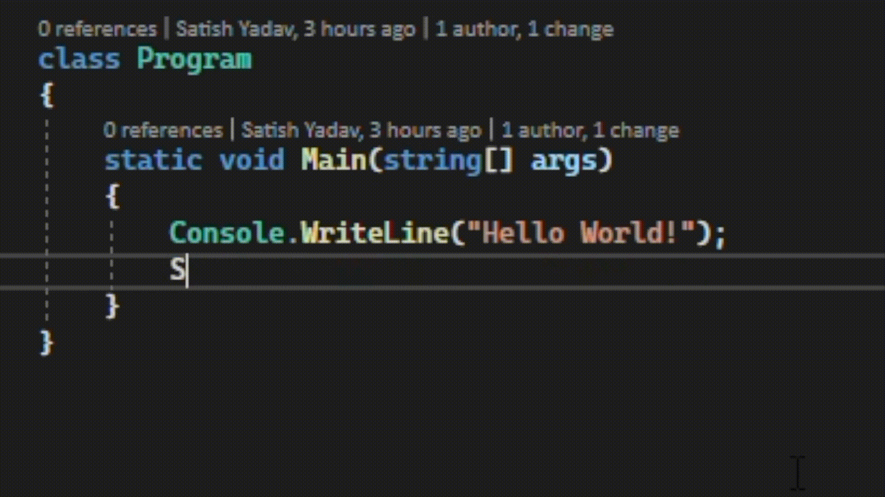

# Visual Studio 2022 will write code for you!!! - Visual Studio 2022 Series - Part 1
## Introduction
Visual Studio 2022 Preview 1 is now available! If you've missed the [official announcement](https://devblogs.microsoft.com/visualstudio/visual-studio-2022-preview-1-now-available/) on June 17th, 2021 - check it out.
If you want to try out, head over to the official download page [here](https://visualstudio.microsoft.com/vs/preview/vs2022/).

The Visual Studio 2022 previews can be installed side-by-side with earlier versions of Visual Studio, are available in all three editions (Community, Pro, and Enterprise), and are free to use.

## New Features
A lot of new features have come out in this release, however Visual Studio 2022 is just out with Preview 1, meaning there will be more and more new features coming in new Previews.

But today I want to talk about 2 of my favorite features:
* 64-bit
* IntelliCode

### 64-bit
The first and the biggest feature is - and boy, that's big one - it's 64-bit!!! 😍 This means - Visual Studio 2022 will no longer be limited to ~4gb of memory in the main `devenv.exe` process. 
In Microsoft's own words:

> With a 64-bit Visual Studio on Windows, you can open, edit, run, and debug even the biggest and most complex solutions without running out of memory.

This doesn't mean you can't develop 32-bit applications using Visual Studio 2022, it just means the Visual Studio itself wil be able to fully utilize your 64-bit hardware.

### IntelliCode - one step further
This one's my favorite new feature. We all know and love [IntelliCode](https://visualstudio.microsoft.com/services/intellicode/) - Microsoft's AI enabled Visual Studio component which suggests code changes using Machine Learning Model based on 1000s of Open-Source GitHub repositories and optionally your own repositories if you permit.

In Visual Studio 2022, IntelliCode has gone one step further and not only will suggest the code changes, it'll will write the code for you. Look at this GIF:

* As soon as I write `StringBuilder` it knows what I'm about to write and with the `TAB` press, it writes `StringBuilder sb = new StringBuilder();` for me. 
* Similarly in the `foreach` loop, it know I'm going to append the `item` to the `StringBuilder` and writes `sb.Append(item)` for me.
* Finally after the loop it knows I want to print it, so it prints using `Console.WriteLine` by calling `ToString()` on the `StringBuilder` reference `sb`.

Cool, write!!!

## Conclusion
This is just a Preview 1, there will be at-lest 4-5 previews before it hits GA - General Availability. So watch out for more posts.

Let me know which all features ya'll are excited for.

## Next Steps
* Read more about [IntelliCode](https://visualstudio.microsoft.com/services/intellicode/).
* Check out the [Official announcement](https://devblogs.microsoft.com/visualstudio/visual-studio-2022-preview-1-now-available/)
* Download [Visual Studio 2022](https://visualstudio.microsoft.com/vs/preview/vs2022/) and try now.

